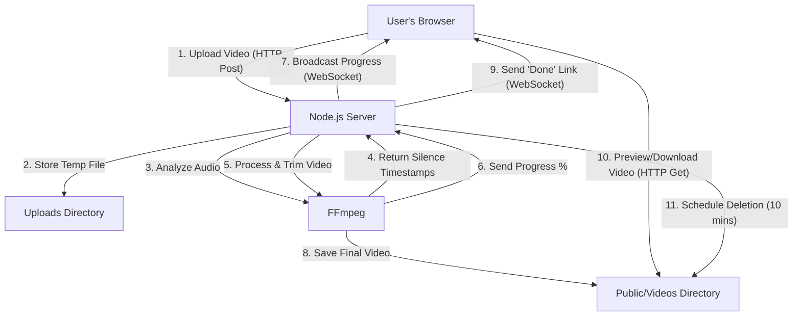

# Video Silence Remover By Dixon Zor

### A full-stack web application designed to automatically detect and remove silent segments from videos, streamlining the editing process for content creators.


---

This tool provides a simple and powerful interface for users to upload large video files. The server handles all the heavy processing, providing real-time feedback before allowing users to preview and download the final, trimmed video.

*(Optional: Insert a GIF of the application in action here)*

---

## Key Features

-   **Server-Side Processing:** Built with **Node.js** and **Express** to reliably handle large video files that would crash a browser-based application.
-   **Silence Detection:** Utilizes **FFmpeg** on the backend to accurately analyze audio streams and identify silent segments based on user-defined decibel thresholds and durations.
-   **Real-Time Progress:** A **WebSocket** connection provides continuous, real-time feedback, updating a single, seamless progress bar that represents both file upload and server-side video processing.
-   **User-Friendly Interface:** A clean and intuitive UI built with **HTML5** and **Tailwind CSS**, featuring drag-and-drop file uploads for an enhanced user experience.
-   **Preview Before Download:** Users can watch the fully trimmed video directly on the page before committing to a download, ensuring the output meets their expectations.
-   **Privacy Focused:** All uploaded and processed videos are **automatically deleted** from the server after 10 minutes to ensure user privacy and manage server storage.
-   **Broad File Support:** Accepts a wide range of video formats, including `.mp4`, `.mov`, `.mkv`, `.webm`, and `.avi`.

---

## System Architecture

The application follows a client-server model where the frontend is responsible for the user interface and the backend handles all intensive processing tasks. This architecture is designed for scalability and robustness.



---

## Technology Stack

### Backend
-   **Node.js:** Event-driven JavaScript runtime for the server.
-   **Express.js:** Web application framework for handling API endpoints and routing.
-   **FFmpeg (`fluent-ffmpeg`):** The core engine for all video and audio manipulation. The installer packages (`@ffmpeg-installer/ffmpeg`, `@ffprobe-installer/ffprobe`) are used to manage the binaries.
-   **WebSockets (`ws`):** Enables real-time, two-way communication for the progress bar and logging.
-   **Multer:** Middleware for handling `multipart/form-data`, used for file uploads.

### Frontend
-   **HTML5:** Standard markup for the web application structure.
-   **Tailwind CSS:** A utility-first CSS framework for styling the user interface.
-   **Vanilla JavaScript:** Used for DOM manipulation, event handling (including drag-and-drop), and WebSocket communication.

---

## Setup and Installation

### Prerequisites
-   **Node.js:** Download from [nodejs.org](https://nodejs.org/). The FFmpeg and FFprobe binaries are handled by `npm`, so a separate installation is not required.

### Running Locally
1.  Clone the repository:
    ```bash
    git clone <your-repository-url>
    ```
2.  Navigate to the project directory:
    ```bash
    cd video-silence-remover
    ```
3.  Install the necessary dependencies from `package.json`. This will also download the correct FFmpeg/FFprobe executables for your system.
    ```bash
    npm install
    ```
4.  Start the server:
    ```bash
    node server.js
    ```
5.  Open your browser and navigate to `http://localhost:3000`.

---

## Contact

-   **Dixon Zor (deetalk)**
-   **YouTube:** [youtube.com/@DeeMedia21](https://www.youtube.com/@DeeMedia21)
-   **Email:** [dixonfzor@gmail.com](mailto:dixonfzor@gmail.com)
-   **LinkedIn:** [linkedinn.co/in/dixon-zor](https://linkedinn.co/in/dixon-zor)
